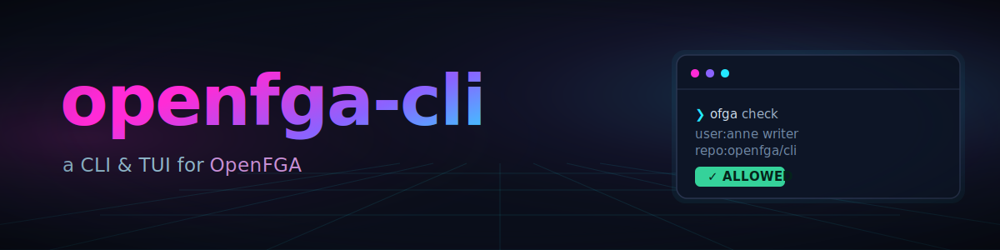

<div align="center">



# ofga

**A modern CLI & TUI for [OpenFGA](https://openfga.dev).**

Manage stores, authorization models, relationship tuples, and run checks from your terminal — or explore everything interactively in a full-screen TUI.

[Quick start](#-quick-start) · [The TUI](#-the-interactive-tui) · [Commands](#-command-reference) · [Configuration](#-configuration) · [Contributing](#-contributing)

</div>

[](https://github.com/sergiught/openfga-cli/actions/workflows/ci.yml)
[](https://github.com/sergiught/openfga-cli/actions/workflows/codeql.yml)
[](https://goreportcard.com/report/github.com/sergiught/openfga-cli)
[](https://github.com/sergiught/openfga-cli/releases)
[](go.mod)
[](https://github.com/sergiught/openfga-cli/pkgs/container/ofga)
[](LICENSE)
[](https://www.conventionalcommits.org)
[](CONTRIBUTING.md)

<p align="center">
  
</p>

---

## 📑 Table of contents

- [✨ What is this?](#-what-is-this)
- [🚀 Quick start](#-quick-start)
- [📦 Installation](#-installation)
- [⬆️ Upgrade and uninstall](#️-upgrade-and-uninstall)
- [🖥 The interactive TUI](#-the-interactive-tui)
- [📋 Command reference](#-command-reference)
- [🧪 Testing authorization models](#-testing-authorization-models)
- [🛠 Configuration](#-configuration)
- [🔑 Authentication](#-authentication)
- [🩺 Troubleshooting](#-troubleshooting)
- [⌨️ Shell completion](#️-shell-completion)
- [🤝 Scripting & automation](#-scripting--automation)
- [🏗 Contributing](#-contributing)
- [⚖️ License](#️-license)

---

## ✨ What is this?

`ofga` is a single, dependency-free binary that gives you two ways to work with an OpenFGA server:

- 🧰 **A scriptable CLI** — create stores, write and inspect authorization models, manage relationship tuples, run `check`/`list-objects`/`list-users`, and run assertion suites. Read commands provide consistent JSON/YAML output, tabular commands support `--plain`, and failures return meaningful exit codes.
- 🖥 **A full-screen TUI** — launch it by running `ofga` with no arguments. Browse stores, visualize a model as a colored relation graph, edit tuples, run queries and expand their resolution trees, and manage assertions — all with the keyboard **or the mouse**.

It talks to any OpenFGA-compatible server and reuses your connection **profiles** so you can switch between local, staging, and production in one flag.

> **Naming:** the official OpenFGA CLI is `fga`. This is a separate, independent reimagining focused on ergonomics and an interactive TUI, distributed as `ofga`. It is not affiliated with OpenFGA.

---

## 🚀 Quick start


```bash
# 1. Start a local OpenFGA server in another terminal
docker run --rm --name openfga -p 8080:8080 openfga/openfga run

# 2. Point ofga at it (guided; uses http://localhost:8080 by default)
ofga init

# 3. Create a store and make it active
ofga stores create demo --use

# 4. Write an authorization model
cat > model.fga <<'FGA'
model
  schema 1.1

type user

type document
  relations
    define viewer: [user]
FGA
ofga model write --file model.fga
# `.fga` DSL is transformed to JSON for you. `--file` also takes a `.json`
# model, or `-` to read from stdin.

# 5. Add a relationship tuple
ofga tuples write user:anne viewer document:roadmap

# 6. Ask an authorization question
ofga query check user:anne viewer document:roadmap
# ✓ ALLOWED  user:anne viewer document:roadmap

# 7. …or explore everything interactively
ofga
```

Already have a server? Skip step 1 and pass its URL to `ofga init`.

---

## 📦 Installation

### Homebrew (macOS / Linux)

```bash
brew install sergiught/tap/ofga
```

### Arch Linux (AUR)

```bash
yay -S ofga-bin        # or: paru -S ofga-bin
```

### `go install`

```bash
go install github.com/sergiught/openfga-cli/cmd/ofga@latest
```

### Install script (recommended)

```bash
# Latest stable release.
curl -fsSL https://raw.githubusercontent.com/sergiught/openfga-cli/main/install.sh | bash

# A specific release.
curl -fsSL https://raw.githubusercontent.com/sergiught/openfga-cli/main/install.sh | bash -s -- v1.0.0

# Install without sudo.
BIN_DIR="$HOME/.local/bin" bash <(curl -fsSL https://raw.githubusercontent.com/sergiught/openfga-cli/main/install.sh)
```

The script detects Linux or macOS on x86-64 or ARM64, downloads the matching
GoReleaser archive, verifies its SHA-256 checksum, and installs `ofga`. Review
the [`install.sh`](install.sh) source before piping it to Bash if preferred.
Every [release](https://github.com/sergiught/openfga-cli/releases) also includes
checksums, an SPDX SBOM, and signed provenance.

### Docker

```bash
docker run --rm -it --network host ghcr.io/sergiught/ofga:latest stores list
```

### From source

```bash
git clone https://github.com/sergiught/openfga-cli
cd openfga-cli
go build -o ofga ./cmd/ofga
```

Verify your install:

```bash
ofga version
```

---

## ⬆️ Upgrade and uninstall

Upgrade with the same installation method used to install `ofga`:

```bash
brew upgrade ofga
yay -Syu ofga-bin
go install github.com/sergiught/openfga-cli/cmd/ofga@latest
curl -fsSL https://raw.githubusercontent.com/sergiught/openfga-cli/main/install.sh | bash
```

Before removing the binary, use `ofga profiles remove <name>` for saved
profiles whose keyring credentials should also be deleted. Then uninstall the
package (`brew uninstall ofga`, your system package manager, or
`rm "$(command -v ofga)"`). Remove the remaining configuration directory only
if it is no longer needed:

```bash
rm -rf "$(dirname "$(ofga config path)")"
```

---

## 🖥 The interactive TUI

Run `ofga` with no arguments to launch the interactive playground. It's a keyboard- **and mouse**-driven cockpit for the whole OpenFGA surface.

The playground uses the same resolved profile as CLI commands: `ofga --profile
staging playground` opens staging without changing the saved default. Profile,
store, and model switches made inside the playground are reflected immediately
in its footer and subsequent actions.

**Sections** (switch with `tab`, the number keys `1`–`8`, `ctrl+k` for the command palette, or **click a tab**): Profiles · Stores · Model · Tuples · Changes · Tuple Queries · Assertions · API Logs.

**Highlights**

- 🎨 **Model graph** — the authorization model rendered as a colored tree of types, relations, and inherited (tuple-to-userset) paths.
- 🔎 **Query + resolution tree** — run `check`/`list-objects`/`list-users`/`list-relations` and expand *why* a decision was made.
- ✍️ **Inline editing** — add/delete tuples, edit assertions, and edit the model DSL, with **inline validation** as you type.
- 🖱 **Full mouse support** — wheel-scroll the graph and lists, click tabs and list rows, click the footer keycaps as buttons, and click outside a dialog to dismiss it.
- 🎭 **Themes** — `aurora`, `catppuccin`, `charm`, `dracula`, `gruvbox`, `nord`, `tokyonight`, and a `mono` (NO_COLOR-friendly) theme.

**Keys:** press `?` at any time for the full, context-aware keybinding overlay.

> The TUI only launches on an interactive terminal. In a pipe or CI, bare `ofga` prints help instead of hanging.

---

## 📋 Command reference

| Command | What it does |
| --- | --- |
| `ofga` | Launch the interactive TUI |
| `ofga playground` | Explicit subcommand form of bare `ofga`; launches the interactive TUI |
| `ofga init` | Guided first-run setup (creates a connection profile) |
| `ofga stores` | Create, list, inspect and delete stores |
| `ofga model` | Write (from JSON **or `.fga` DSL**), list, inspect, **visualize** (`model graph`), and **test** (`model test`) authorization models |
| `ofga tuples` | Write, delete, read relationship tuples and follow the changelog |
| `ofga query` | Ask authorization questions: `check`, `batch-check`, `expand`, `list-objects`, `list-users` |
| `ofga assertions` | Read, write, and **run** a model's assertion test-suite |
| `ofga api` | Send a raw request to the OpenFGA API using the active profile's auth |
| `ofga profiles` | Manage connection profiles (add/list/show/current/use/set/unset/remove/cleanup-credentials) |
| `ofga config` | Inspect configuration (`config path`) |
| `ofga theme` | Show or set the color theme |
| `ofga completion` | Generate a shell completion script |
| `ofga version` | Print version and build info |

Run `ofga <command> --help` for details and examples on any command.

---

## 🧪 Testing authorization models

`ofga model test` runs a workspace of authorization-model tests against a
hermetic, **embedded** OpenFGA server — no Docker container, no real store,
no profile involved. Each run gets a disposable in-memory server and a fresh
store, so testing never touches anything you're actually connected to.

New here? `ofga model test init` scaffolds a runnable workspace (a manifest, a
small model, a fixture, and a passing test) in the current directory — run
`ofga model test` in it to see a green run and learn the format.

### Workspace layout

```
myworkspace/
├── ofga.yaml              # manifest
├── model.fga
├── fixtures/
│   └── core-users.yaml    # named, reusable tuple sets
└── tests/
    └── documents.test.yaml
```

`ofga.yaml` is discovered by walking up from the current directory (like
`go.mod`); a positional path or `--file`/`-f` overrides it:

```yaml
version: 1
model: ./model.fga
fixtures:
  - "fixtures/**/*.yaml"
tests:
  - "tests/**/*.test.yaml"
```

`fixtures` and `tests` are both glob patterns that register files. A test file
can reference a fixture by its filename without the extension when that name is
unique, or by its workspace-relative path (`teams/acme/grants`) when directories
contain duplicate basenames. Test identities use the same relative convention,
so `teams/acme/access.test.yaml` is selected as `teams/acme/access/*`. In the
manifest and at the top of a test file, `fixtures:` and `tuples:` are
interchangeable keywords for the same list — use whichever reads better.

The manifest may also carry an optional `server:` map that tunes the embedded
server before the tests run. Supported keys are `list_objects_max_results`,
`list_users_max_results` (both already raised well above stock so a test-sized
`list_objects`/`list_users` result is returned in full rather than truncated),
`max_types_per_authorization_model`, `resolve_node_limit`,
`resolve_node_breadth_limit`, and `max_concurrent_reads_for_check`; an unknown
key is a hard error. `server:` only tunes the default embedded engine and is
ignored under `--openfga-image`/`--server-addr`.

A test file (`tests/documents.test.yaml`):

```yaml
fixtures: [core-users]
tests:
  - name: owner-is-viewer
    check:
      - user: user:anne
        object: document:1
        assertions: {viewer: true, owner: true}
  - name: stranger-denied
    check:
      - user: user:bob
        object: document:1
        assertions: {viewer: false}
  - name: members-can-view-both-docs
    check:
      # share one assertions block across every user × object combination
      - users: [user:anne, user:carol]
        objects: [document:1, document:2]
        assertions: {viewer: true}
```

Each test can also declare its own `fixtures:` and `tuples:` (interchangeable —
each entry is a fixture reference or an inline tuple), and assert with
`list_objects`/`list_users` blocks alongside `check`. A tuple may be written as
a mapping (`{user: user:anne, relation: viewer, object: doc:1}`) or in the
compact `user relation object` form (`user:anne viewer doc:1`); the mapping form
is required for a conditioned tuple. Fixture files are registered by the
manifest's `fixtures` globs and may be YAML, JSON, JSONL, or CSV; an exact
duplicate tuple across fixtures is a hard error unless `--dedupe-fixtures` is
set. A `list_users` assertion accepts either the flat `relation: [users]` form
(parallel to `list_objects`) or the wrapped `relation: {users: [...]}` form.

A single `*.test.yaml` file can also stand on its own, without any `ofga.yaml`:
pass it directly (`ofga model test path/to/foo.test.yaml`) and, if it declares
its own top-level `model:` field, it runs manifest-free against that model.

### Editor completion and validation

`ofga model test init` writes `workspace.schema.json` and schema modelines into
the scaffold, so YAML completion and validation work immediately. Existing
workspaces can either pin the schema shipped with the installed CLI:

```bash
ofga model test schema > workspace.schema.json
```

or reference the hosted v1 schema directly:

```yaml
# ofga.yaml
# yaml-language-server: $schema=https://raw.githubusercontent.com/sergiught/openfga-cli/main/internal/modeltest/schema/workspace.v1.json#manifest

# *.test.yaml
# yaml-language-server: $schema=https://raw.githubusercontent.com/sergiught/openfga-cli/main/internal/modeltest/schema/workspace.v1.json#testFile
```

### Running tests

```bash
ofga model test                        # discovers ofga.yaml here or in a parent dir
ofga model test path/to/ofga.yaml
ofga model test --run "documents/*"    # glob over "<relative-file>/<test-name>"
ofga model test --parallel 4           # cap concurrent tests (0 = number of CPUs)
ofga model test --fail-fast            # stop after the first failing test
ofga model test --timeout 30s          # bound each test's engine work (0 = no timeout)
ofga model test --slowest 5            # after the run, list the 5 slowest tests
ofga model test --watch                # re-run on every file change (Ctrl-C to stop)

# No manifest? Pass the pieces directly (flags also override a manifest's fields):
ofga model test --model model.fga --tests 'tests/**/*.test.yaml' --fixtures 'fixtures/**/*.yaml'
```

A failure prints the expected/got values, a resolution tree, and a
"nearest miss" suggestion. `--explain full` prints that resolution tree for
**every** assertion, passing or failing, not just failures.

### Coverage and CI

```bash
ofga model test --coverage --coverage-min 80
ofga model test --coverage-diff main          # fail on newly-added, untested branches
```

`--coverage` prints a per-type coverage table tracking rewrite-rule branch
coverage. Coverage is **grant-based**: a rewrite branch — a direct/wildcard
type, a computed or tuple-to-userset arm, a `but not` exclusion, or an ABAC
condition outcome — counts as covered only when a `check` assertion showed that
specific arm *granting*. So an arm you never exercise stays uncovered even if its
relation is otherwise tested (e.g. `viewer: [user] or owner` tested only via an
owner shows `direct:user` uncovered until a direct viewer is checked). ABAC
conditions track their true and false outcomes separately. Non-empty
`list_objects` / `list_users` results have no per-arm resolution tree, so they
credit at relation granularity; empty denial results add no grant coverage.
Use `check` assertions for precise per-arm coverage.
`--coverage-detail` adds full per-branch detail to the human
report. `--coverage-min` fails the run (exit `3`) if coverage falls short of the
given percentage — wire that into CI.

If a model contains a relation the coverage engine cannot enumerate, the JSON
report sets `coverage.complete` to `false`, the human report names the
unreachable relation, and the command exits non-zero rather than publishing a
misleading 100% score.

`--coverage-diff <git-ref>` compares the model against that ref and fails
(exit `3`) if your change **added** a branch that no test exercises — matching
the same relation granularity: it catches branches under an entirely-untested
relation and newly-added untested condition outcomes. It's the "don't merge an
untested authorization branch" gate for PRs.

By default tests run against a hermetic **embedded** OpenFGA server (no Docker,
microsecond startup). To test against a **specific server version** instead —
catching version-to-version behavior differences — point it at Docker or a
running server:

```bash
ofga model test --openfga-image openfga/openfga:v1.5.0   # Docker, auto-managed
ofga model test --server-addr localhost:8081             # a server you already run (gRPC)
```

```bash
ofga model test --report junit --report-file results.xml
ofga model test --report json --report-file results.json
ofga model test --report github   # GitHub Actions ::error annotations
```

`--report` writes a report in the given format alongside the normal output, for
CI: `junit` (XML for test dashboards), `json` (the same result shape as
`-o json`, for writing to a file), or `github` (GitHub Actions `::error`
annotations linked to the authored test file and line, so failures surface in
the Actions log, job summary, and changed-files view). With
`--report-file`, the report is written to that path; without it, it is printed
to the terminal.

Exit codes: `0` all tests passed, `3` a test failed or the coverage gate
tripped, `2` bad invocation (unknown flag, invalid flag combination), `1` the
workspace could not be loaded (missing `ofga.yaml`, bad model path, malformed
YAML, unknown fixture) or the test engine failed to start (e.g. Docker
unavailable under `--openfga-image`, or an unreachable `--server-addr`).

### Exploring a test's world

```bash
ofga model test --playground
```

`--playground` runs the suite as usual and then, on a TTY, boots the embedded
server over HTTP and opens the interactive playground against a failing test's
seeded world (falling back to the first test when everything passes) so you can
explore and drill into every result. The seeded data is shown under a clearly
labeled ephemeral profile (`✦ model-test (seeded)`) — your real profiles stay
listed and switchable, and nothing about the seeded run is ever written to your
config. With `--no-tui` (or no TTY) it prints a note and skips the TUI.

Try it against the example workspace shipped in this repo — a documented,
13-test suite covering inheritance, exclusion, and ABAC conditions (see
[`examples/model-tests/`](examples/model-tests) and its README):

```bash
ofga model test examples/model-tests --coverage
```

---

## 🛠 Configuration

`ofga` stores configuration in the platform config directory (the XDG config
directory on Linux and the user Preferences directory on macOS). Find the
exact file with:

```bash
ofga config path
```

### Profiles

A **profile** bundles an API URL, an optional store and model ID, and auth settings. Switch between environments with `--profile`/`-p` or the `OPENFGA_PROFILE` env var.

```bash
ofga profiles add prod --api-url https://fga.example.com \
  --auth-method api_token --token-stdin < token.txt
ofga profiles use prod
ofga profiles show                # resolved active config (secrets masked)
ofga --profile staging stores list
```

The file is intentionally straightforward TOML:

```toml
version = 1
active_profile = "local"
theme = "aurora"

[profiles.local]
api_url = "http://localhost:8080"

[profiles.local.auth]
method = "none"
```

Prefer `ofga profiles add`, `set`, `unset`, and `remove` over editing the file:
they preserve atomic writes and keep managed credentials synchronized with the
OS keyring. If another process changes the file while `ofga` is running, the
save is rejected rather than overwriting the newer configuration.

### Precedence

Connection values are resolved in increasing order of precedence:

**profile → environment variables → command-line flags (including secret-file flags)**

Authentication overrides are method-aware: client secrets apply only to
`client_credentials`, private keys apply only to `private_key_jwt`, and an
explicit API-token file selects API-token authentication for that process.

### Environment variables

| Variable | Purpose |
| --- | --- |
| `OPENFGA_API_URL` | API URL (alias: `FGA_API_URL`) |
| `OPENFGA_STORE_ID` | Active store ID (alias: `FGA_STORE_ID`) |
| `OPENFGA_MODEL_ID` | Authorization model ID (aliases: `OPENFGA_AUTHORIZATION_MODEL_ID`, `FGA_MODEL_ID`, `FGA_AUTHORIZATION_MODEL_ID`) |
| `OPENFGA_API_TOKEN` | API bearer token compatibility fallback; prefer `--auth-token-file` (alias: `FGA_API_TOKEN`) |
| `OPENFGA_CLIENT_ID` | OAuth2 client ID for `client_credentials` (alias: `FGA_CLIENT_ID`) |
| `OPENFGA_CLIENT_SECRET` | OAuth2 secret compatibility fallback; prefer `--auth-client-secret-file` (alias: `FGA_CLIENT_SECRET`) |
| `OPENFGA_TOKEN_URL` | OAuth2 token endpoint for `client_credentials` (alias: `FGA_TOKEN_URL`) |
| `OPENFGA_API_AUDIENCE` | OAuth2 audience for `client_credentials` (alias: `FGA_API_AUDIENCE`) |
| `OPENFGA_SCOPES` | OAuth2 scopes for `client_credentials` (alias: `FGA_SCOPES`) |
| `OPENFGA_KEY_FILE` | Path to the PEM signing key; applies to a `private_key_jwt` profile (alias: `FGA_KEY_FILE`) |
| `OPENFGA_PROFILE` | Profile to use (alias: `FGA_PROFILE`) |
| `OPENFGA_CONFIG` | Path to the config file (overridden by the `--config` flag) |
| `OPENFGA_ICONS` | Icon mode: `nerdfont` (default), `unicode`, or `off` |
| `OPENFGA_REDUCED_MOTION` | Suppress TUI animations (alias: `OFGA_REDUCED_MOTION`) |
| `NO_COLOR` | Disable colored output |
| `CLICOLOR_FORCE` | Force colored output even when piped or redirected |
| `FORCE_COLOR` | Force colored output even when piped or redirected (equivalent to `CLICOLOR_FORCE`) |

`FGA_*` aliases are accepted for compatibility with the official CLI.

---

## 🔑 Authentication

`ofga` supports the same auth methods as OpenFGA:

- **None** — for a local, unauthenticated server.
- **API token** — a pre-shared bearer token.
- **Client credentials** — OAuth2 client-credentials grant.
- **Private key JWT** — OAuth2 with a client-assertion JWT.

Secrets should be provided without exposing them in your shell history or `ps`:

```bash
# API token
ofga profiles add prod --api-url https://fga.example.com \
  --auth-method api_token --token-stdin < token.txt

# OAuth2 client credentials
ofga profiles add ci --api-url https://fga.example.com \
  --auth-method client_credentials --client-id "$CLIENT_ID" \
  --client-secret-stdin --token-url https://issuer.example.com/oauth/token \
  --audience https://fga.example.com < client-secret.txt

# OAuth2 private-key JWT
ofga profiles add workload --api-url https://fga.example.com \
  --auth-method private_key_jwt --client-id "$CLIENT_ID" \
  --token-url https://issuer.example.com/oauth/token \
  --audience https://issuer.example.com/ \
  --api-audience https://fga.example.com --key-file ./signing-key.pem
```

The config file is written atomically with `0600` permissions. Tokens, client
secrets, and private-key contents supplied through `profiles set private_key`
are stored in the OS keyring under a namespace derived from the config path, so
two `--config` files cannot share credentials accidentally. The TOML file
contains managed-secret markers rather than plaintext credentials, and
`profiles show` masks secrets. `key_file` is different: TOML stores its path
and the PEM remains in that file on disk.

For one process only, override a profile's managed credential from a file:

```bash
ofga --profile prod --auth-token-file /run/secrets/fga-token stores list
ofga --profile ci --auth-client-secret-file /run/secrets/oauth-secret stores list
ofga --profile workload --auth-private-key-file /run/secrets/signing.pem stores list
```

These flags avoid both argv secret values and environment inheritance. Secret
environment variables remain available for compatibility and CI systems that
cannot mount secret files. Use `ofga profiles unset token` (or
`client_secret`/`private_key`) to remove a saved credential from the keyring.
To delete **all** ofga-managed secrets from the OS keyring at once — every
profile's credentials plus orphans left by deleted configs — run
`ofga profiles cleanup-credentials --purge` (it prompts for confirmation;
`--force` skips it).
Authentication settings are checked before a request, so incomplete profiles
fail locally with an actionable error. Secret files should be mode `0600`;
`ofga` warns when they are accessible by other users.

API and OAuth token endpoints must be configured at their final URLs. Redirects
are rejected rather than followed so credentials cannot be forwarded to a
different host or downgraded connection.

## 🩺 Troubleshooting

| Symptom | Resolution |
| --- | --- |
| `connection refused` at `localhost:8080` | Start OpenFGA (see [Quick start](#-quick-start)) or select the correct `--profile`/`--api-url`. |
| `no store selected` | Pass `--store-id`, set `OPENFGA_STORE_ID`, or run `ofga profiles set store_id <id>`. |
| The OS keyring is unavailable in a headless container | Mount a secret and use a process-scoped `--auth-*-file` flag. Saved secrets deliberately fail closed rather than entering TOML. |
| Credential cleanup was deferred | Restore keyring access, then run `ofga profiles cleanup-credentials`. Pending exact-field cleanup is stored in the same config file and never deletes a credential still used by a profile. |
| `config changed on disk since it was loaded` | Another process saved first. Re-run the command or reopen the playground to load the newer file. |
| An API or OAuth URL returns a redirect | Configure the final destination URL directly. Redirects are intentionally disabled for credential safety. |
| The playground does not start | It requires an interactive terminal. Use `ofga playground` locally; in CI use a CLI subcommand with `--no-input`. |
| Warning about credentials over HTTP | Use HTTPS for both the OpenFGA API and OAuth token URL. HTTP is only treated as safe for loopback development. |

---

## ⌨️ Shell completion

```bash
# bash
source <(ofga completion bash)
# zsh
ofga completion zsh > "${fpath[1]}/_ofga"
# fish
ofga completion fish | source
# PowerShell
ofga completion powershell | Out-String | Invoke-Expression
```

Completion is **dynamic**: `--profile`, `--store-id`, and `--model-id` (and the matching positional args) complete real profile names, store IDs, and model IDs from your server. Network-backed completions are bounded by a short timeout so they never hang your shell.

---

## 🤝 Scripting & automation

`ofga` is built to compose:

- `--json` emits clean, machine-readable JSON (secrets omitted) for `jq`.
- `--yaml` (or `-o yaml` / `--output yaml`) emits the same structured data as YAML, for tools that prefer it (e.g. diffing against a YAML-based config).
- `--plain` emits unstyled TSV for both reads and mutations; embedded tabs,
  newlines, and control characters are normalized to spaces so every item
  remains one record. Key/value results are `key<TAB>value`, and
  `query check --plain` prints `allowed`/`denied`.
- Meaningful **exit codes**: `0` success, `1` generic failure, `2` usage error, `3` failed `model test` (or coverage gate), `4` network error, `130` interrupted by Ctrl-C/SIGINT.
- First-class server mutation commands support `-n`/`--dry-run`; `ofga api` is an expert escape hatch.
- Destructive replacements and deletes prompt on a TTY and require `--force` when non-interactive, so scripts fail safe.
- Piped output drops colors and box-drawing automatically.
- `--timeout` bounds each HTTP request (30 seconds by default; `0` disables it).
- `--no-input` prevents prompts and disables the bare-command TUI for automation running under a pseudo-TTY.
- A downstream consumer that closes stdout early (for example `| head`) is
  treated as normal pipeline completion unless a command-specific failure must
  take precedence.
- `ofga api --plain` preserves the response body bytes rather than
  pretty-printing JSON, adding only a missing final newline.

Bulk tuple writes/deletes are sent in server-sized batches and are not
transactional across batches. If a later batch fails, JSON/YAML and plain
output report `written`/`deleted`, `total`, and `complete: false` before the
command exits non-zero. Automation should inspect the exit status and treat
the reported count as already committed.

> **Note:** `ofga tuples read`, `ofga tuples changes`, `ofga stores list`, and
> `ofga model list` auto-paginate and return **all** rows by default
> (`--page-size` only sets the per-request page size, not a total cap). Against
> a large store that can be a lot of output—cap it with `--max-results`
> (alias `--limit`), or pipe through `head` or `--json | jq`.

```bash
# Which documents can anne view?
ofga query list-objects document viewer user:anne --plain

# Fail a CI job if the assertion suite regresses
ofga assertions test || exit 1
```

---

## 🏗 Contributing

Contributions are welcome! Please read [CONTRIBUTING.md](CONTRIBUTING.md) for the build/test/lint workflow and the [Conventional Commits](https://www.conventionalcommits.org) convention used for automated releases.

Report bugs and request features through [GitHub Issues](https://github.com/sergiught/openfga-cli/issues). Report vulnerabilities privately as described in [SECURITY.md](SECURITY.md).

```bash
go build ./...
go test ./...
```

---

## ⚖️ License

[MIT](LICENSE) © Sergiu Ghitea. Built for the excellent [OpenFGA](https://openfga.dev) project (not affiliated).
