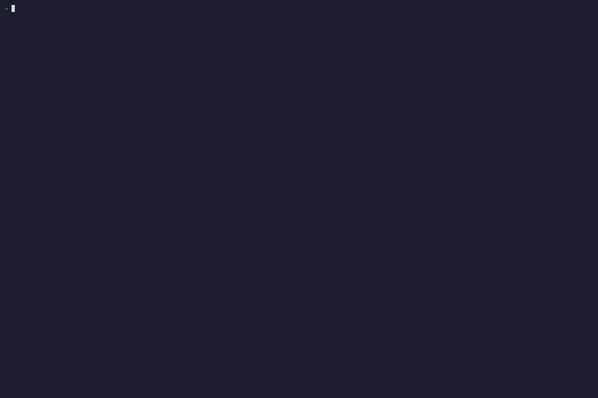

# Testing authorization models

`ofga model test` runs a workspace of authorization-model tests against a
hermetic, **embedded** OpenFGA server — no Docker container, no real store,
no profile involved. Each run gets a disposable in-memory server and a fresh
store, so testing never touches anything you're actually connected to.


*Running the example workspace with `--coverage` from the CLI.*



*`ofga model test --playground` opens the results in the playground's Tests tab, with in-TUI coverage.*

New here? `ofga model test init` scaffolds a runnable workspace (a manifest, a
small model, a fixture, and a passing test) in the current directory — run
`ofga model test` in it to see a green run and learn the format.

### Workspace layout

```
myworkspace/
├── ofga.yaml              # manifest
├── model.fga
├── fixtures/
│   └── core-users.yaml    # named, reusable tuple sets
└── tests/
    └── documents.test.yaml
```

`ofga.yaml` is discovered by walking up from the current directory (like
`go.mod`); a positional path or `--file`/`-f` overrides it:

```yaml
version: 1
model: ./model.fga
fixtures:
  - "fixtures/**/*.yaml"
tests:
  - "tests/**/*.test.yaml"
```

`fixtures` and `tests` are both glob patterns that register files. A test file
can reference a fixture by its filename without the extension when that name is
unique, or by its workspace-relative path (`teams/acme/grants`) when directories
contain duplicate basenames. Test identities use the same relative convention,
so `teams/acme/access.test.yaml` is selected as `teams/acme/access/*`. In the
manifest and at the top of a test file, `fixtures:` and `tuples:` are
interchangeable keywords for the same list — use whichever reads better.

The manifest may also carry an optional `server:` map that tunes the embedded
server before the tests run. Supported keys are `list_objects_max_results`,
`list_users_max_results` (both already raised well above stock so a test-sized
`list_objects`/`list_users` result is returned in full rather than truncated),
`max_types_per_authorization_model`, `resolve_node_limit`,
`resolve_node_breadth_limit`, and `max_concurrent_reads_for_check`; an unknown
key is a hard error. `server:` only tunes the default embedded engine and is
ignored under `--openfga-image`/`--server-addr`.

A test file (`tests/documents.test.yaml`):

```yaml
fixtures: [core-users]
tests:
  - name: owner-is-viewer
    check:
      - user: user:anne
        object: document:1
        assertions: {viewer: true, owner: true}
  - name: stranger-denied
    check:
      - user: user:bob
        object: document:1
        assertions: {viewer: false}
  - name: members-can-view-both-docs
    check:
      # share one assertions block across every user × object combination
      - users: [user:anne, user:carol]
        objects: [document:1, document:2]
        assertions: {viewer: true}
```

Each test can also declare its own `fixtures:` and `tuples:` (interchangeable —
each entry is a fixture reference or an inline tuple), and assert with
`list_objects`/`list_users` blocks alongside `check`. A tuple may be written as
a mapping (`{user: user:anne, relation: viewer, object: doc:1}`) or in the
compact `user relation object` form (`user:anne viewer doc:1`); the mapping form
is required for a conditioned tuple. Fixture files are registered by the
manifest's `fixtures` globs and may be YAML, JSON, JSONL, or CSV; an exact
duplicate tuple across fixtures is a hard error unless `--dedupe-fixtures` is
set. A `list_users` assertion accepts either the flat `relation: [users]` form
(parallel to `list_objects`) or the wrapped `relation: {users: [...]}` form.

A single `*.test.yaml` file can also stand on its own, without any `ofga.yaml`:
pass it directly (`ofga model test path/to/foo.test.yaml`) and, if it declares
its own top-level `model:` field, it runs manifest-free against that model.

### Editor completion and validation

`ofga model test init` writes `workspace.schema.json` and schema modelines into
the scaffold, so YAML completion and validation work immediately. Existing
workspaces can either pin the schema shipped with the installed CLI:

```bash
ofga model test schema > workspace.schema.json
```

or reference the hosted v1 schema directly:

```yaml
# ofga.yaml
# yaml-language-server: $schema=https://raw.githubusercontent.com/sergiught/openfga-cli/main/internal/modeltest/schema/workspace.v1.json#manifest

# *.test.yaml
# yaml-language-server: $schema=https://raw.githubusercontent.com/sergiught/openfga-cli/main/internal/modeltest/schema/workspace.v1.json#testFile
```

### Running tests

```bash
ofga model test                        # discovers ofga.yaml here or in a parent dir
ofga model test path/to/ofga.yaml
ofga model test --run "documents/*"    # glob over "<relative-file>/<test-name>"
ofga model test --parallel 4           # cap concurrent tests (0 = number of CPUs)
ofga model test --fail-fast            # stop after the first failing test
ofga model test --timeout 30s          # bound each test's engine work (0 = no timeout)
ofga model test --slowest 5            # after the run, list the 5 slowest tests
ofga model test --watch                # re-run on every file change (Ctrl-C to stop)

# No manifest? Pass the pieces directly (flags also override a manifest's fields):
ofga model test --model model.fga --tests 'tests/**/*.test.yaml' --fixtures 'fixtures/**/*.yaml'
```

A failure prints the expected/got values, a resolution tree, and a
"nearest miss" suggestion. `--explain full` prints that resolution tree for
**every** assertion, passing or failing, not just failures.

### Coverage and CI

```bash
ofga model test --coverage --coverage-min 80
ofga model test --coverage-diff main          # fail on newly-added, untested branches
```

`--coverage` prints a per-type coverage table tracking rewrite-rule branch
coverage. Coverage is **grant-based**: a rewrite branch — a direct/wildcard
type, a computed or tuple-to-userset arm, a `but not` exclusion, or an ABAC
condition outcome — counts as covered only when a `check` assertion showed that
specific arm *granting*. So an arm you never exercise stays uncovered even if its
relation is otherwise tested (e.g. `viewer: [user] or owner` tested only via an
owner shows `direct:user` uncovered until a direct viewer is checked). ABAC
conditions track their true and false outcomes separately. Non-empty
`list_objects` / `list_users` results have no per-arm resolution tree, so they
credit at relation granularity; empty denial results add no grant coverage.
Use `check` assertions for precise per-arm coverage.
`--coverage-detail` adds full per-branch detail to the human
report. `--coverage-min` fails the run (exit `3`) if coverage falls short of the
given percentage — wire that into CI.

If a model contains a relation the coverage engine cannot enumerate, the JSON
report sets `coverage.complete` to `false`, the human report names the
unreachable relation, and the command exits non-zero rather than publishing a
misleading 100% score.

`--coverage-diff <git-ref>` compares the model against that ref and fails
(exit `3`) if your change **added** a branch that no test exercises — matching
the same relation granularity: it catches branches under an entirely-untested
relation and newly-added untested condition outcomes. It's the "don't merge an
untested authorization branch" gate for PRs.

By default tests run against a hermetic **embedded** OpenFGA server (no Docker,
microsecond startup). To test against a **specific server version** instead —
catching version-to-version behavior differences — point it at Docker or a
running server:

```bash
ofga model test --openfga-image openfga/openfga:v1.5.0   # Docker, auto-managed
ofga model test --server-addr localhost:8081             # a server you already run (gRPC)
```

```bash
ofga model test --report junit --report-file results.xml
ofga model test --report json --report-file results.json
ofga model test --report github   # GitHub Actions ::error annotations
```

`--report` writes a report in the given format alongside the normal output, for
CI: `junit` (XML for test dashboards), `json` (the same result shape as
`-o json`, for writing to a file), or `github` (GitHub Actions `::error`
annotations linked to the authored test file and line, so failures surface in
the Actions log, job summary, and changed-files view). With
`--report-file`, the report is written to that path; without it, it is printed
to the terminal.

Exit codes: `0` all tests passed, `3` a test failed or the coverage gate
tripped, `2` bad invocation (unknown flag, invalid flag combination), `1` the
workspace could not be loaded (missing `ofga.yaml`, bad model path, malformed
YAML, unknown fixture) or the test engine failed to start (e.g. Docker
unavailable under `--openfga-image`, or an unreachable `--server-addr`).

### Exploring a test's world

```bash
ofga model test --playground
```

`--playground` runs the suite as usual and then, on a TTY, boots the embedded
server over HTTP and opens the interactive playground against a failing test's
seeded world (falling back to the first test when everything passes) so you can
explore and drill into every result. The seeded data is shown under a clearly
labeled ephemeral profile (`✦ model-test (seeded)`) — your real profiles stay
listed and switchable, and nothing about the seeded run is ever written to your
config. With `--no-tui` (or no TTY) it prints a note and skips the TUI.

Try it against the example workspace shipped in this repo — a documented,
13-test suite covering inheritance, exclusion, and ABAC conditions (see
[`examples/model-tests/`](../../examples/model-tests) and its README):

```bash
ofga model test examples/model-tests --coverage
```
