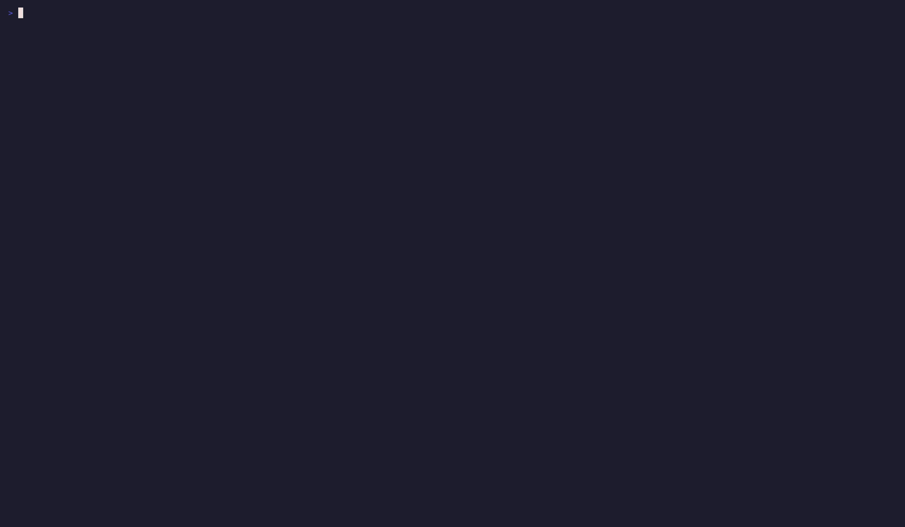

# Example recordings

Demo GIFs for the `ofga` CLI and TUI, generated with
[charmbracelet/vhs](https://github.com/charmbracelet/vhs).

| GIF | Shows |
| --- | --- |
|  | The interactive `ofga` playground TUI: browsing stores, model, tuples, and live API logs. |
|  | A CLI flow: create a store, write a model, write a tuple, and check access. |
|  | `ofga init`: guided setup of a connection profile. |
|  | `ofga stores`: create, list, and inspect stores. |
|  | `ofga model`: write, inspect, and visualize an authorization model. |
|  | `ofga tuples`: write, read, and delete relationship tuples. |
|  | `ofga query`: check, list-objects, list-users, and expand. |
|  | `ofga assertions`: write and run a model's assertion test-suite. |
|  | `ofga api`: the raw API escape hatch. |
|  | `ofga profiles`: manage named connection profiles. |
|  | `ofga model test --coverage`: running the example workspace's tests with branch-coverage reporting from the CLI. |
|  | `ofga model test --playground`: exploring test results and coverage in the playground's Tests tab. |

## Regenerating

`make gifs` records every `examples/tapes/*.tape` (except the shared
`_setup.tape`, which individual tapes `Source` for profile/store/model
seeding) into the matching `examples/*.gif`.

Requires [`vhs`](https://github.com/charmbracelet/vhs) and its runtime
dependencies (`ttyd`, `ffmpeg`) on your `PATH`.

```bash
make demo      # bring up + seed the local OpenFGA + auth0-mock stack
make gifs      # record every tape into examples/*.gif
make demo-down # tear the stack down
```

Most tapes talk to the `make demo` stack over a seeded profile. The two
`model-test*` tapes are the exception: `model-test.tape` and
`model-test-tui.tape` run `ofga model test` against OpenFGA's embedded,
in-process server, so they need no stack at all.

Every tape isolates `XDG_CONFIG_HOME` to a temporary directory before running,
so recording never touches your real `ofga` config.
